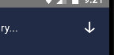
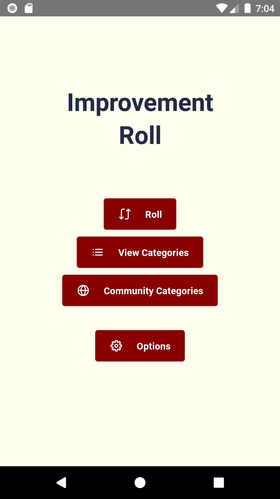
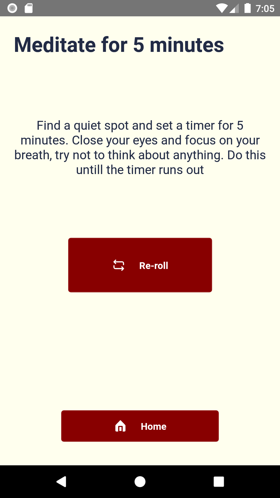

---
A randomly selected to-do list

## What??
Inspired from "rolling" threads on 4chan. You can create a category of tasks that you want to do (in no particular order).
Then press the button, and it will randomly give you a task to do from said list.

You can also sort tasks in a category by how long it would take to complete them and randomly select based on time.

There is already a pre-generated category available called **General**

## Updating from version 1.2.x

**First off, export all categories to ensure you wont lose anything!**

With version 1.3 there is a change from `time` to `minutes`.  Rolling is governed by that and the new `timeRange` variable set in advanced settings (which is default to 2).
This makes category creation more flexible as you no longer need to adhear to the strict time ranges that were there before.

However, if you have categories with tasks that are still using `time` there may be some unforseen effects from updating to v1.3+.
In general this is what you can do to roll those older categories over:

- In the app edit the category's tasks. Each task will have a blank input for minutes. Set the appropriate minutes for each task and save the category
- You can also export your categories, edit the `time` attribute to `minutes`, set the appropriate minutes, Reset the data on the app (found in adv settings), and import them back into the app.

Go [HERE](https://github.com/vukani-dev/improvement-roll/tree/main/READMEv1.2.md) for docs on the older version.

### Simple Example:
Say you want to get in shape but are too lazy to commit to a program.
You can create a Category called **Fitness**.
And in the **Fitness** category you can add tasks like:
- Do 50 push-ups
- Squat for 5 minutes
- Do 40 Jumping Jacks
- *etc*

Then whenever you have free time you can open the app and select the **Fitness** category and a random one of these tasks will be given to you.
Now it's up to you to do them, but at least you didn't have to think about what to do :wink:

### Timed Example:
I bet you're thinking:
*What if the random task I've been given takes too much time to complete!* :worried:

Whether you are or aren't I built this feature anyway!

Let's say you are in the same situation as the simple example.
You can create the same Category called **Fitness**
During the category creation, toggle the "This category is split by time" box.
Now you can enter in tasks and enter how many minutes it takes for you to complete them.

#### New in v1.3+
Once you select the **Fitness** category to roll this time, you will be asked how much time you have. 
You can enter exactly how many minutes you have, and the app will give you a task that's less than that amount up to a range of **2** minutes (this can be changed in advance settings).
**For example**: If you enter **15** minutes and the time range is set to **2** you will be given a task that is between 13 and 15 minutes.

Also included are a selection of quick time ranges you can select. These are generated based on the category you selected.

This feature allows you to be more creative with how you design your categories and flexible when it comes to rolling.

## Community Categories

### Importing
You can import Categories made by others via the `Community Categories` page.
Its as simple as selecting the Category and pressing the Import Button in the top right hand corner: 

### Search/Filter
There is also a search field at the top of the page that can be revealed by pressing the magnifying glass.
With this, you can filter the categories by:

- **Name** ⇾ The name of the category 
- **Author** ⇾ The author of the category
- **Tags** ⇾ Any included tags of the category

### Adding 
The categories come from an API that's generated by the following [Repo](https://github.com/vukani-dev/improvement-roll-service)
More info can be found there on how to add a category of your own.

## Import/Export

### Importing

If creating Categories on the app is too cumbersome, you can create Categories via text editor and import them into the app.
This feature is located in the options page.

Available formats:

- **JSON**
- **TOML**
- **YAML**

However, only with **JSON** and **YAML** can you import multiple Categories from one file.
Examples can be found under [categories/examples](https://github.com/vukani-dev/improvement-roll/tree/main/categories/examples)
The `minutes` variable under tasks is associated with the time it takes to usually complete it. This is only necessary for Categories that are timeSensitive (denoted by `timeSensitive` bool under the Category).

### Exporting

Categories in the app can also be exported into any of the supported formats. They will automatically be exported to your Downloads folder. Once again, the *Export All* feature is only available if you are exporting to **JSON**.

Both of these features require the app to need permission to read/save files on your phone. If you are not using this feature, the permissions are not needed.

## Advanced Settings
On the Advanced Settings page (which can be found from the Options page) you will find a couple of tweaks:

- **Time range settings** ⇾ allows you to set the time range used for exact rolls. This number is how many minutes below your entered minutes the rolling algorithm will pull from. 
  - For example, with a time range of 0 when you roll and enter 15 as the amount of minutes you have, you will only be given tasks that take exactly 15 minutes. With a time range of 7 you will be given tasks that take from 8 to 15 minutes.
- **Debug mode toggle** ⇾ This enables debug mode. You will see logs being written to a file called `imp-roll-logs.txt`. Not all events and functions are being logged at the moment, but this is a work in process :wink:. This is really helpful for debugging strange bugs users have.
- **Reset option** ⇾ This will wipe the memory of the app back to its initial state.

## Development

### Linux

- Follow react-native instructions for setting up the environment
  - Essentially you need the following and any relevant tools added to your path:
    - Java version 8 (I use 8 from openjdk)
    - Node/npm (I use nvm to install a specific LTS version, which is 14.17.4)
    - Android SDK Manager (You can install via android-studio or command-line tool)
      - Android SDK Platform 29
      - Intel x86 Atom_64 System Image
      - Android SDK Tools 29.0.2
    - An android VM or device connected to pc

- `npm i` to install packages
- `npm start` to start react native server
- open another terminal
- `npm run android` start the app

### Using Nix Flake

A Nix flake is available for reproducible development environments:

- Install Nix with flakes enabled: https://nixos.org/
- Run `nix develop` in the project root to enter the dev environment
- Run `npm i` to install packages
- Run `npm start` to start the React Native server
- Open another terminal and run `npm run android` to launch the app

## Screenshots

## What are these "rolling" threads
On 4chan every post give you a corresponding ID. The ID generated from a post is what people would refer to as "rolling".

*For example:*
You could create a thread that says the last Number of your ID will determine how many push-ups you do in that instance. People would then post as a reply to that thread to find out how many push-ups they would do.
